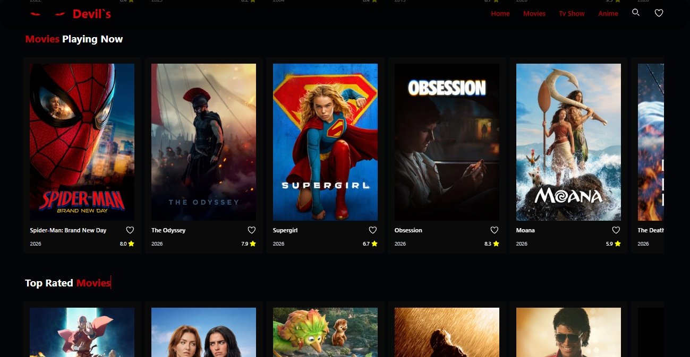
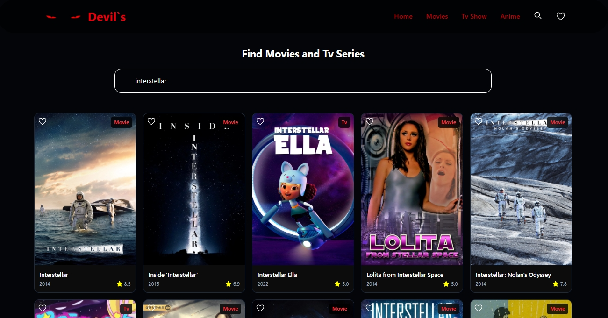
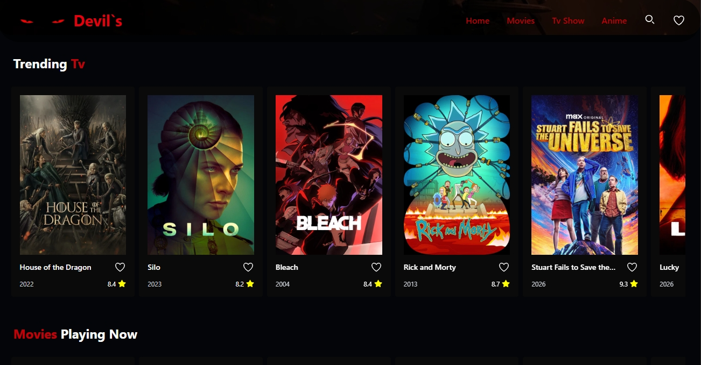
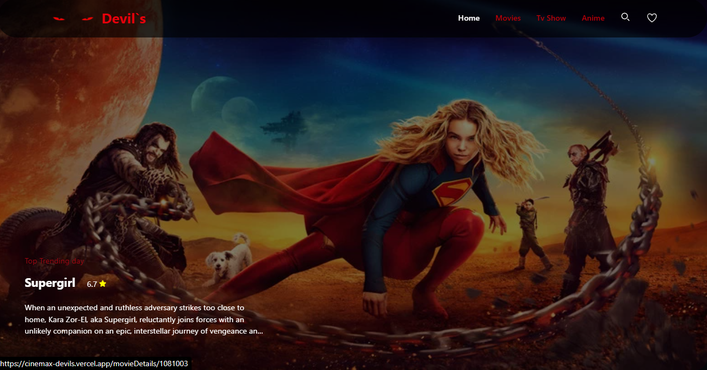
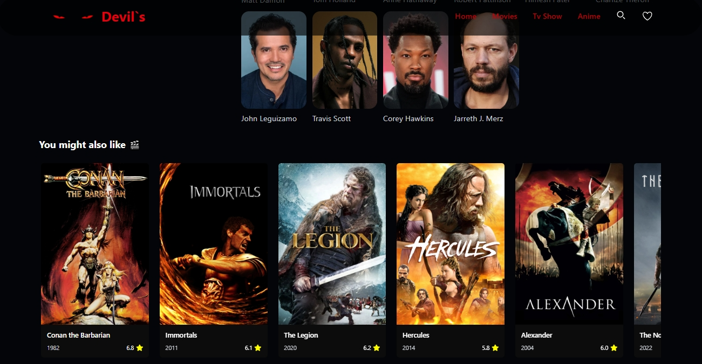
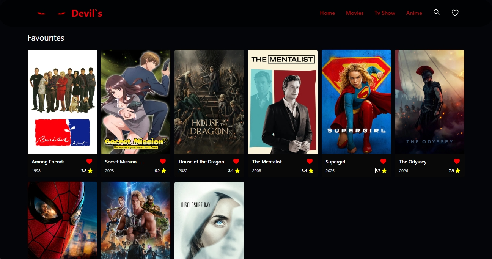

# 🎬 Movie App

A modern and responsive movie discovery application built with **React** and **Vite**, powered by the **TMDB API**. Browse trending movies, TV series, anime, watch trailers, search for your favorite titles, and explore detailed information with a clean and intuitive user interface.

---

## 🌐 Live Demo

👉 https://cinemax-devils.vercel.app/

---

## ✨ Features

- 🔥 Browse Trending Movies
- ⭐ Discover Top Rated Movies
- 🎬 Explore Popular Movies
- 📺 Browse TV Series
- 🎌 Explore Anime
- 🔍 Search for Movies & TV Shows
- 📄 Detailed Movie Information
- 🎥 Watch Official Trailers
- 💡 Related & Recommended Movies
- ❤️ Add & Remove Favorites
- ⭐ View Movie Ratings
- 📱 Fully Responsive Design
- ⚡ Fast and Smooth User Experience

---

## 🛠️ Tech Stack

- React
- Vite
- JavaScript (ES6+)
- TMDB API
- React Router DOM
- Axios
- tailwind
- aos animation
- CSS3
- Font Awesome
- react icons
- Vercel

---

## 📸 Screenshots

<p align="center">
  
  
  
  
    
    
    
  
</p>

---

## ⚙️ Installation

Clone the repository

```bash
git clone https://github.com/Mohamedxismail/YOUR-REPOSITORY-NAME.git
```

Go to the project directory

```bash
cd YOUR-REPOSITORY-NAME
```

Install dependencies

```bash
npm install
```

Create a `.env` file and add your TMDB API Key.

```env
VITE_TMDB_API_KEY=YOUR_API_KEY
```

Run the development server

```bash
npm run dev
```

Open your browser

```
http://localhost:5173
```

---

## 📂 Project Structure

```
src/
├── assets/
├── components/
├── pages/
├── context/
├── hooks/
├── services/
├── router/
├── App.jsx
└── main.jsx
```

---

## 🚀 API

This project uses **The Movie Database (TMDB) API** to provide:

- Trending Movies
- Popular Movies
- Top Rated Movies
- TV Series
- Anime
- Search
- Movie Details
- Trailers
- Recommendations
- Ratings

---

## 🚀 Deployment

The application is deployed on **Vercel**.

👉 https://cinemax-devils.vercel.app/

---

## 👨‍💻 Author

**Mohamed Ismail**

- GitHub: https://github.com/Mohamedxismail
- LinkedIn: www.linkedin.com/in/mohamed-ismail-81217a33b

---

### ⭐ If you like this project, don't forget to give it a star!
